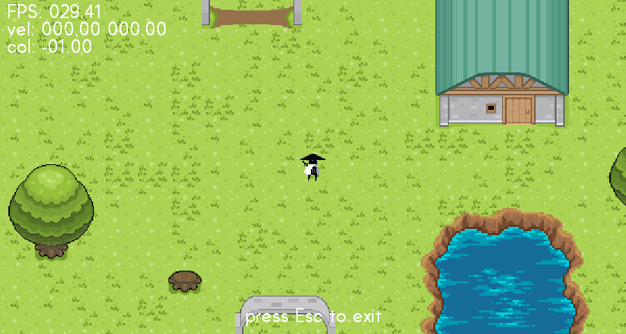

# Introduction

This project is based on Matt Owen's tutorial: [Pygame ARPG Tutorial Series](https://www.youtube.com/watch?v=a1NIscbsmKo&list=PLLdd2IQ6qKU7OAOpVdaK304D_BGSOw3iW&pp=iAQB)

Ninja sprite is from the same author: [Monochrome ninja](https://mowen88.itch.io/monochrome-ninjaa)

Cursor by: [Precision icons created by redempticon - Flaticon](https://www.flaticon.com/free-icons/precision)

pip install --no-deps pygame-menu-ce
