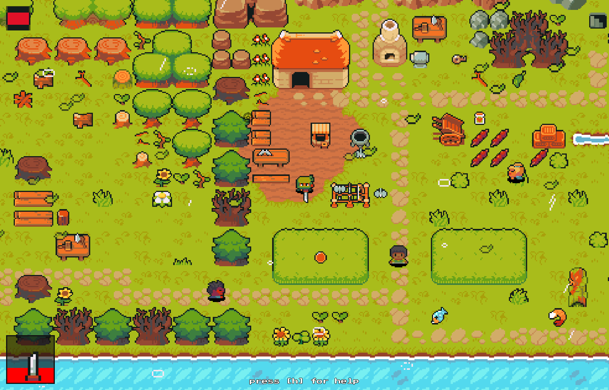

# Introduction


[](https://opensource.org/licenses/MIT)

This is a template for a game using [Pygame-CE](https://pyga.me/) that can run both on **desktop** and int the **Web** browser



You can play it online:

- [](https://hubertrex.github.io/pygame-ce-web-boilerplate/NinjaAdventure)

- [](https://hubertnafalski.itch.io/top-down-rpg)

Build using:


## TOC

- [Features](#features)
- [Known bugs](#known-bugs)
- [Ideas for future](#ideas-for-future)
- [Installation](#installation)
- [Run](#run)
- [Deploying](#deploying)
- [Contribution](#contribution)

## Features

- runs both on **desktop** and in the **web browser** ([itch.io](https://itch.io) and [GitHub Pages](https://pages.github.com/)) thanks to [pygbag](https://pygame-web.github.io/)
- implemented **finite state machine** (states: _Menu_, _Scene_, _Splash screen_)
- usage of menus [pygame-menu](https://github.com/ppizarror/pygame-menu) (patched - `gfxdraw` was not working in **WEB**)
- **keyboard** (_arrows_, _WSAD_) and **mouse** support (player control and in menus)
- a custom **mouse** cursor loaded from **PNG** file
- **maps** can be created using [Tiled](https://www.mapeditor.org/) - loaded using [pytmx](https://github.com/bitcraft/pytmx)
- maps **live reloading**, **scrolling**, and **zooming** - using [pyscroll](https://github.com/bitcraft/pyscroll)
- configurable **transition** between maps (custom properties in [Tiled](https://www.mapeditor.org/) maps)
- map with **layers** (walls, markers for spawning points and map entry/exits)
- procedurally generated **mazes** with randomly placed **decors**
- semi-transparent panels and text with background (alpha blending)
- full-screen **color filtering** (alpha blending, e.g.: warm sunny light, dark blue at night)
- postprocessing OpenGL/WebGL **shaders** ([zengl](https://github.com/szabolcsdombi/zengl)): _saturated_, _black&white_, _retro CRT monitor_
- **day** and **night** cycle (implemented using shaders for better performance)
- functionality that allows **animate** any numerical value of the game like camera position, time of day allowing to create custom **cutscenes**
  - non-numerical values and any other game function can be scheduled for execution at given time (_chain_, _delay_)
  - complete workflow to create `json` with **cutscene** definition and automatic execution - separation from core game logic
  - different kinds of **transitions** between changed values (_linear_, _quad_, _sin_, _anticipation_, _overshoot_  with '_in_', '_out_', '_in&out_' and more)
  - **PoC** of exemplary game **intro** can be tested by pressing **F4**
  - based on [Bitcraft's](https://github.com/bitcraft) genius [animation](https://github.com/bitcraft/animation) module
- particle system (_falling leaves_, _rain_, more to come)
- game manual and auto **pause** (if the game window is out of focus)
- pixel style **monospace font**
- **animated sprites** with static mockup shadows, and health bar - NPCs animations can be customized for new asset pack, by changing `SPRITE_SHEET_DEFINITION` in [settings.py](./project/settings.py#L165)
- **NPCs** states (_Idle_, _Bored_, _Walk_, _Run_, _Jump_, _Fly_, _Stunned_)
- **NPCs** **path finding** [A*](https://panda-man.medium.com/a-pathfinding-algorithm-efficiently-navigating-the-maze-of-possibilities-8bb16f9cecbd) with different step cost depending on surface type (road speeds up, water slows down)
- **NPCs** follow individual lists of waypoints defined inside [Tiled](https://www.mapeditor.org/) map or automatically moving towards set target (e.g. **Player**)
- global game **config** thanks to [Pydantic](https://github.com/pydantic/pydantic)
  - **config** is stored in `json` file and validated on load using `json schema` (**schema** autogenerated using **pydantic**)
  - [config.json](project/config_model/config.json) can be directly edited in **VS Code**, no dedicated editor yet, but thanks to **schema** it can be validated and autocompleted in the editor
  - **NPCs'** and **Player's** **traits** kept in **config** - easy to change, clean separation of logic and settings
  - in code, config is used as if it was **dataclass** - type hinting, properties names autocompletion (and not just a `dict[str, Any]`)
  - in future, **quests**, **dialogs** and other game definitions will go here
- separation of **key bindings** from **actions** - easy to customize in one file
- scene **transitions** (_fade in/out_, _circle shutter close/open_)
- build-in **screenshots** saving (in both **desktop** and **Web** modes)
- build-in gameplay **recordings** saving (*.mp4) thanks to [ffmpeg-python](https://github.com/kkroening/ffmpeg-python) - only in **desktop** mode
- automatic **build** and **deploy** from selected branch to [GitHub Pages](.github/workflows/pygbag.yml) and [itch.io](.github/workflows/itch_io.yml) using **GitHub action**

## Known bugs

- ✅ ~~screenshot of menu not working (showing only part of menu)~~ - `done`
- ✅ ~~some key events are lost (action is repeated even key is not pressed in menus)~~ - `done`
- ✅ ~~after transition between game **Scenes**, game state is not preserved~~ - `done`
- ✅ ~~low performance of **A**_function - delaying of **A**_ calls (no need to do it every frame)~~ - `done`
- ✅ ~~very low performance of **color filtering** (alpha blending) on **Windows** (heavy on **CPU**), although works well on **Macbook** - to be moved into **shader**~~ - `done`
- ✅ ~~**pydantic** not imported properly in **WEB** (problem with **pygbag**)~~ - as workaround **WEB** version uses static dataclasses - `done`
- **camera** randomly stops **following** the **Player**
- game not loading on **Firefox**
- Player shouldn't move after **colliding** with **map exit**
- ✅ ~~**leafs** particles are moving in screen coordinates, but should move according to game world coordinates~~ - `done`
- ✅ ~~gameplay recording flickering when night shader is applied~~ - switched to **ffmpeg-python** lib - `done`

## Ideas for future

### Core features

- ✅ ~~list key bindings~~ - `done`
- ✅ ~~create global **config** `json` with `schema`~~ -  `done`
- ⏳ add UI (~~**health bar**~~ ✅, player stats) -  `WIP`
- ⏳ ~~add **particles** system~~ ✅ (~~leafs~~ ✅, ~~wind~~ ✅, _rain_ ✅, _footsteps_, _smoke_) - `WIP`
- ✅ ~~add **day/night** cycle~~ - `done`
- add **weather** conditions changing over time (e.g.: _rain_)
- add **fog of war** and/or **line of sight** - try [this](https://www.redblobgames.com/grids/circle-drawing/)
- ⏳ add **light** sources (~~_around NPCs_~~ ✅, _camp fire_, _torch_, _houses_ ✅) - `WIP`
- ✅ ~~add NPC, enemies with movements (add shadows)~~ - `done`
- add **animals**
- add NPC and Player the ability to move on different **ground levels** (_hills_, _valley_, _bridge_ over lower level)
- add separate `walls` layer used for collision detection when **Player** is **airborn** (e.g.: _jump_, _flying_)
- add **movable** objects
- add object **destruction**
- ✅ ~~add item **drop/pickup** and **inventory** system~~ - `done`
- add **items spawning** on the map
- ✅ ~~separate **Scene** state from currently loaded **map**~~ - `done`
- 💡 add procedurally generated, natural looking **animations**/**movements** (using **Second Order Dynamics**) - `POC`
- ⏳ add **fighting** system - `WIP`
- add **gamepad** controller mapping - useful on handhelds like **SteamDeck**
- add option to play using **touchscreen** - use [this](https://forums.raspberrypi.com/viewtopic.php?t=354101) - first check performance on **mobile** devices
- add **dialog** system
- add **quest** system
- add **merchants**
- ✅ ~~add **cutscenes**~~ - `done`
- add game **save/load** system
- add game **highscore** table
- add game **achievements**
- add **music** and **sfx**
- add better **menus**, **UI/HUD**
- ✅ ~~add **dungeons** (generated procedurally)~~ - `done`
- ✅ ~~add **path finding** algorithm~~ - `done`
- make more **maps**

### Tools and experiments

- add **animated gif** with gameplay for promotion (use ezGif or [DaVinci Resolve](https://www.blackmagicdesign.com/products/davinciresolve/) or simply **ffmpeg** from CLI)
- test **pixel editors**:
  - [Pyxel Edit](https://pyxeledit.com/get.php) - `$9`
  - [Piskel](https://www.piskelapp.com/) - `free`, online
  - [Pixilart](https://www.pixilart.com/) - `free`, online
  - [Photopea](https://www.photopea.com/) - `free`, online
  - [aseprite](https://www.aseprite.org/) - `$20` or [build](https://siytek.com/get-aseprite-for-free-on-mac/) own for [MacOs](https://github.com/Chasnah7/aseprite-build-script-mac) or [Win](https://github.com/Intrivus/Aseductor), `free` copy
    - [PixelLab](https://www.pixellab.ai/) - `free` tier, plugin for Aseprite to generate pixel art, rendered in cloud
    - [RetroDiffusion](https://astropulse.itch.io/retrodiffusion) - `$60` plugins for Aseprite to generate pixel art using Stable Diffusion
  - [PixelVive](https://beta.pixelvibe.com/) - `free` online asset generator
- create **workflow** to quickly create **new assets** (_characters_, _animations_, _tiles_):
  - use **Stable Diffusion**
  - find pixelation filter and apply to images found on net (eg.: for different types of trees)
- test how hard it is to switch to new **assets pack** - at current game state is still doable
  - customize sprite animation config `SPRITE_SHEET_DEFINITION` in [settings.py](./project/settings.py#L165) to new layout, add missing options (mirror, copy default)
  - create new copy of maze template [MazeTileset_clean.tmx](./project/assets/MazeTileset/MazeTileset_clean.tmx) maze map using new tile sheets
  - change tiles IDs in [maze_utils.py](./project/maze_generator/maze_utils.py)
- ⏳ add game page on [itch.io](https://hubertnafalski.itch.io/top-down-rpg) and customize `CSS` (see [link](https://www.youtube.com/watch?v=VM3cnMU4A-M&list=WL&index=11&pp=gAQBiAQB)) - `WIP`
- ✅ ~~add **GitHub action** to automatically deploy to [itch.io](https://itch.io) - use [this](https://github.com/marketplace/actions/itch-io-publish) and [this](https://www.youtube.com/watch?v=TXROTe0ASeM)~~ - `done`
- 💡 animation/movement with the use of `Second Order Dynamics` (**SOD**) - movement with **anticipation** and **overshoot** `proof of concept`ready (see [project/game.py#L89](https://github.com/HubertReX/pygame-ce-web-boilerplate/blob/2ef2c9b98881a237c375b02b0027f6f95fc5ae4d/project/game.py#L89)) - `POC`
- ✅ ~~live **recording** of animation generated by **OpenGL** directly to **mp4** file (see side script [utils/ffmpeg_recorder.py](utils/ffmpeg_recorder.py)) using: **zengl**, **pil**, **numpy**, **ffmpeg**~~ - `done`
- **build** and **distribute** standalone **executables** for 3 major platforms using [NW.js](https://github.com/nwjs/nw.js) - see [link](https://dev.to/jacklehamster/releasing-a-web-game-onto-steam-47cd) - might be useful when releasing on **Steam**
- try out the `Level Designer toolkit` [LDtk](https://ldtk.io/) as supplement or substitution of [Tiled](https://www.mapeditor.org/)
- try out the [Thorpy](https://www.thorpy.org/doc.html) for **UI/HUD** - as full replacement of current **menus** or at least the **heterogeneous texts** for mixed text and formatting (see [doc](https://www.thorpy.org/examples/heterogeneous_texts.html)) - can be useful in **dialogs**
- try out the [Pixel Composer](https://makham.itch.io/pixel-composer) for `$10` - create and animate sprites, including IK based character animation 🤯
- try [Smack Studio](https://smackstudio.com/) for sprite animation using skeletons
- ⏳ test other ways of porting **Python** to the **Web** (see [link](https://github.com/pygame-community/pygame-ce/issues/540)) - `WIP`
- add ability to upload files to the **Web** browser (see [link](https://github.com/pygame-web/showroom/blob/main/src/test_upload.py)) - useful for uploading game **saves** (downloading already works - see [save_screenshot](/project/game.py#L273))
- use [MoviePy](https://github.com/Zulko/moviepy) and **cutscene** functionality to create game **trailer**
- use [ezGif](https://ezgif.com/) - converting video to gif, cutting video
- try [Mode7](https://github.com/bitcraft/mode7) - for fun?

## Installation

```bash
# create venv
python3 -m venv .venv
# activate it
# on Linux/MacOS
source .venv/bin/activate
# on Windows
.venv\Scripts\activate

# install packages
pip install -r requirements.txt
```

## Run

Desktop mode:

```bash
./run.sh
```

***

Browser mode:

```bash
./serve_web.sh
```

open [http://localhost:8000/](http://localhost:8000/) in browser

use [http://localhost:8000#debug](http://localhost:8000/debug) to show Python repl terminal in browser - useful for troubleshooting

## Deploying

### To [itch.io](https://itch.io/)

full instruction [here](https://pygame-web.github.io/wiki/pygbag/itch.io/)

in short:

```bash
./build_itchio.sh
```

upload `'build/web.zip'` to [itch.io](https://itch.io/) or any other hosting service.

***

### To GitHub pages

Manually run [pygbag_build](https://github.com/HubertReX/pygame-ce-web-boilerplate/actions/workflows/pygbag.yml) GitHub action on selected branch.

Full instruction how to setup is [here](https://pygame-web.github.io/wiki/pygbag/github.io/).

## Contribution

This project is based on Matt Owen's tutorial:

[Pygame ARPG Tutorial Series](https://www.youtube.com/watch?v=a1NIscbsmKo&list=PLLdd2IQ6qKU7OAOpVdaK304D_BGSOw3iW&pp=iAQB)

Ninja Sprite is from the same author:

[Monochrome ninja](https://mowen88.itch.io/monochrome-ninja)

Cursor by:

Precision icons created by [redempticon - Flaticon](https://www.flaticon.com/free-icons/precision)

***

[back to ToC](#toc)
