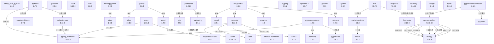

```mermaid
flowchart TD
    classDef missing stroke-dasharray: 5
    annotated-types["annotated-types\n0.7.0"]
    certifi["certifi\n2024.2.2"]
    charset-normalizer["charset-normalizer\n3.3.2"]
    colorama["colorama\n0.4.6"]
    emoji-data-python["emoji_data_python\n1.6.0"]
    emoji["emoji\n1.7.0"]
    ffmpeg-python["ffmpeg-python\n0.2.0"]
    future["future\n1.0.0"]
    glcontext["glcontext\n2.5.0"]
    idna["idna\n3.7"]
    isort["isort\n5.13.2"]
    lxml["lxml\n5.2.2"]
    markdown-it-py["markdown-it-py\n3.0.0"]
    mdurl["mdurl\n0.1.2"]
    mypy-extensions["mypy-extensions\n1.0.0"]
    mypy["mypy\n1.10.0"]
    numpy["numpy\n1.26.4"]
    opencv-python["opencv-python\n4.9.0.80"]
    packaging["packaging\n24.1"]
    pillow["pillow\n10.3.0"]
    pilmoji["pilmoji\n2.0.4"]
    pip["pip\n24.2"]
    pipdeptree["pipdeptree\n2.23.1"]
    progress["progress\n1.6"]
    pydantic-core["pydantic_core\n2.18.2"]
    pydantic["pydantic\n2.7.1"]
    pygame-ce["pygame-ce\n2.4.1"]
    pygame-menu-ce["pygame-menu-ce\n4.4.3"]
    pygame-screen-record["pygame-screen-record\n0.1.1"]
    pygbag["pygbag\n0.9.1"]
    pygments["Pygments\n2.18.0"]
    pyopengl["PyOpenGL\n3.1.7"]
    pyperclip["pyperclip\n1.8.2"]
    pyscroll["pyscroll\n2.31"]
    pytmx["PyTMX\n3.32"]
    requests["requests\n2.32.2"]
    rich["rich\n13.7.1"]
    setuptools["setuptools\n70.0.0"]
    sourcery["sourcery\n1.19.0"]
    thorpy["thorpy\n2.1.8"]
    tqdm["tqdm\n4.66.4"]
    typing-extensions["typing_extensions\n4.10.0"]
    urllib3["urllib3\n2.2.1"]
    zengl-extras["zengl-extras\n0.5.0"]
    zengl["zengl\n2.4.1"]
    ffmpeg-python -- "any" --> future
    markdown-it-py -- "~=0.1" --> mdurl
    mypy -- ">=1.0.0" --> mypy-extensions
    mypy -- ">=4.1.0" --> typing-extensions
    opencv-python -- ">=1.17.0" --> numpy
    opencv-python -- ">=1.17.3" --> numpy
    opencv-python -- ">=1.19.3" --> numpy
    opencv-python -- ">=1.21.2" --> numpy
    opencv-python -- ">=1.21.4" --> numpy
    opencv-python -- ">=1.23.5" --> numpy
    opencv-python -- ">=1.26.0" --> numpy
    pilmoji -- "any" --> emoji
    pilmoji -- "any" --> pillow
    pipdeptree -- ">=23.1" --> packaging
    pipdeptree -- ">=23.1.2" --> pip
    pydantic -- "==2.18.2" --> pydantic-core
    pydantic -- ">=0.4.0" --> annotated-types
    pydantic -- ">=4.6.1" --> typing-extensions
    pydantic-core -- ">=4.6.0,!=4.7.0" --> typing-extensions
    pygame-menu-ce -- ">=2.2.0" --> pygame-ce
    pygame-menu-ce -- "any" --> pyperclip
    pygame-menu-ce -- "any" --> typing-extensions
    pygame-screen-record -- ">=2.1.3" --> pygame
    pygame-screen-record -- ">=4.7.0.68" --> opencv-python
    requests -- ">=1.21.1,<3" --> urllib3
    requests -- ">=2,<4" --> charset-normalizer
    requests -- ">=2.5,<4" --> idna
    requests -- ">=2017.4.17" --> certifi
    rich -- ">=2.13.0,<3.0.0" --> pygments
    rich -- ">=2.2.0" --> markdown-it-py
    zengl-extras -- "any" --> colorama
    zengl-extras -- "any" --> progress
    zengl-extras -- "any" --> requests
    zengl-extras -- "any" --> zengl

```