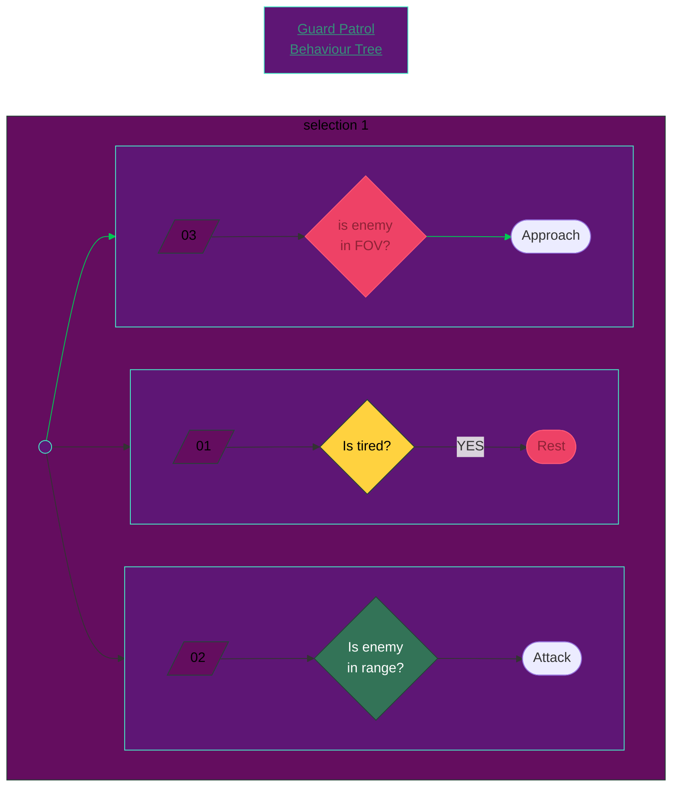

```mermaid
flowchart TD
 subgraph SEL1["selection 1"]
 direction LR
        SEL1_Title
        SG1
        SG2
        SG3
 end

 subgraph SG1[" "]
    direction LR
        S1[/"01"/]:::Select
        C1{"Is tired?"}:::Warn
        A1(["Rest"])
 end

 subgraph SG2[" "]
    direction LR
        S2[/"02"/]
        C2{"Is enemy <br>in range?"}
        A2(["Attack"])
 end

 subgraph SG3[" "]
    direction LR
        S3[/"03"/]
        C3{"is enemy <br>in FOV?"}
        A3(["Approach"])
 end

title["<u>Guard Patrol <br> Behaviour Tree</u>"] --- SEL1
SEL1_Title(( )) --> SG1
SEL1_Title(( )) --> SG2
SEL1_Title(( )) --> SG3

S1 --> C1
C1 -- YES --> A1
S2 --> C2
C2 --> A2
S3 --> C3
C3 --> A3


    %% SEL1_Title@{ shape: f-circ}
    %% style C1 fill:#D50000
    title:::Bag
    %% S1:::Select
    S2:::Select
    S3:::Select
    SEL1_Title:::Bag
    A1:::Rose
    SG1:::Bag
    SG2:::Bag
    SG3:::Bag
    %% C1:::Warn
    C2:::Pine
    C3:::Rose
    SEL1:::Select
    classDef Bag stroke-width:1px, stroke-dasharray:none, stroke:#46EDC8, fill:#5E1675, color:#378E7A
    classDef Pine stroke-width:1px, stroke-dasharray:none, stroke:#254336, fill:#337357, color:#FFFFFF
    classDef Rose stroke-width:1px, stroke-dasharray:none, stroke:#FF5978, fill:#EE4266, color:#8E2236
    classDef Warn stroke-width:1px, stroke-dasharray:none, stroke:#254336, fill:#FFD23F, color:#000000
    classDef Select stroke-width:1px, stroke-dasharray:none, stroke:#254336, fill:#640D5F, color:#000000

    linkStyle 0 stroke:#FFF,stroke-width:0,fill:none
    %% linkStyle 1 stroke:#FFF,stroke-width:0,fill:none
    %% linkStyle 2 stroke:#FFF,stroke-width:0,fill:none
    linkStyle 3 stroke:#00C853
    linkStyle 9 stroke:#00C853
    %% linkStyle 10 stroke:#00C853
    %% linkStyle 11 stroke:#00C853
```